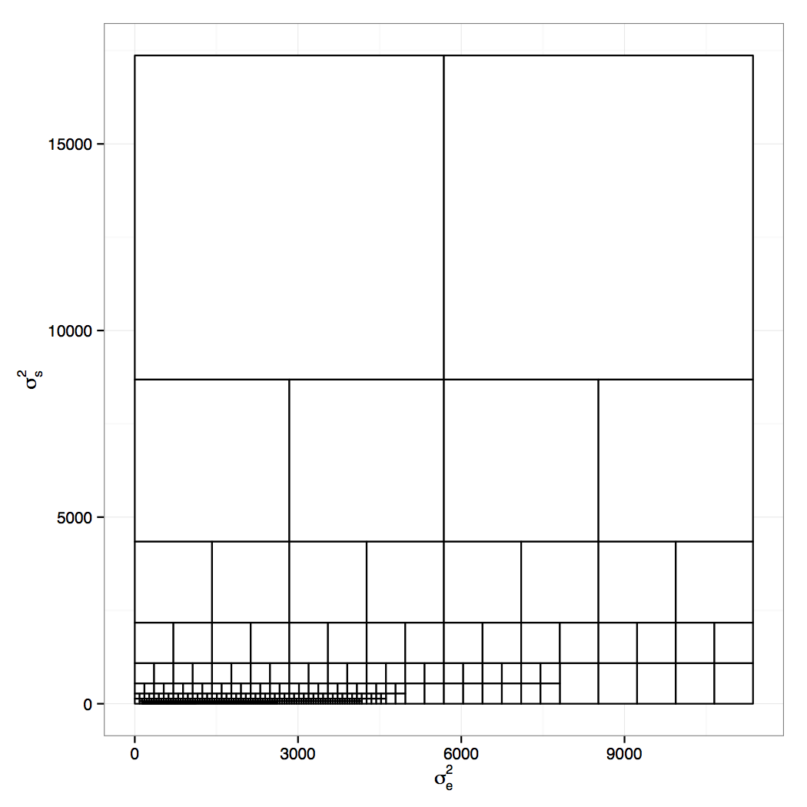
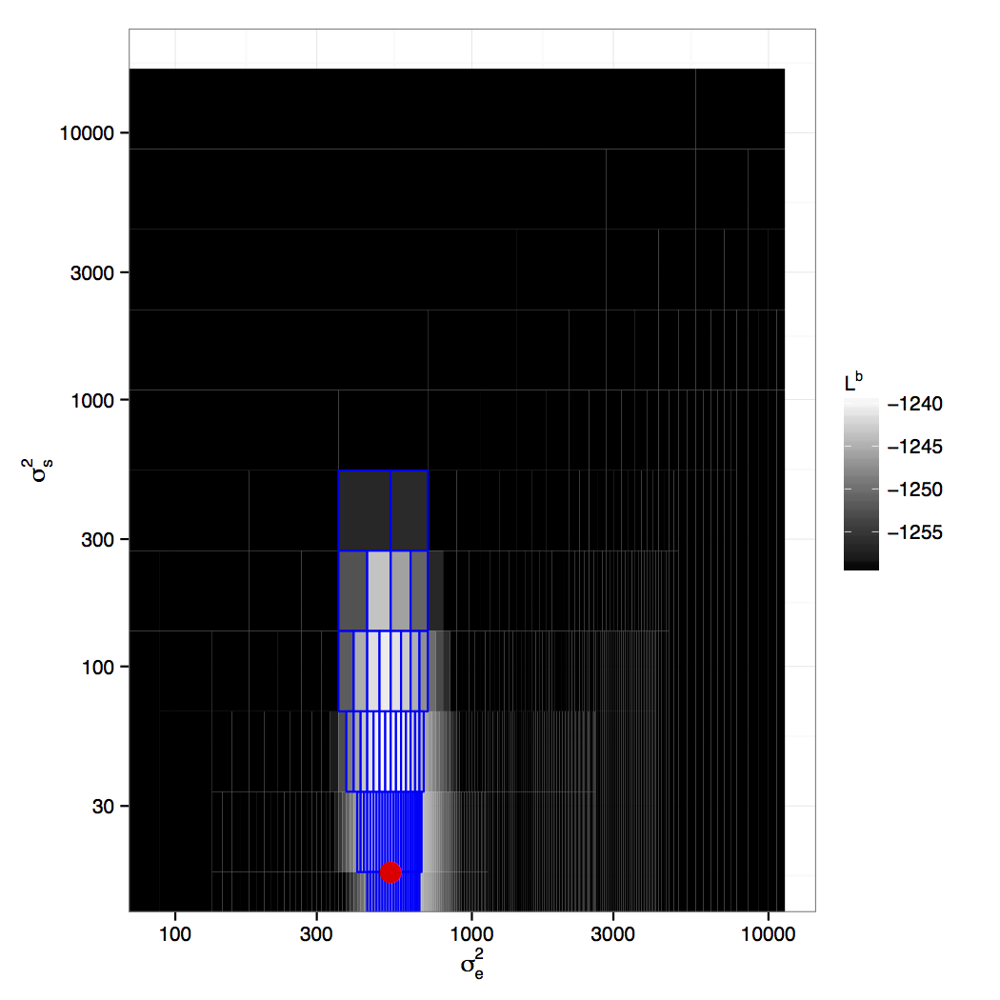
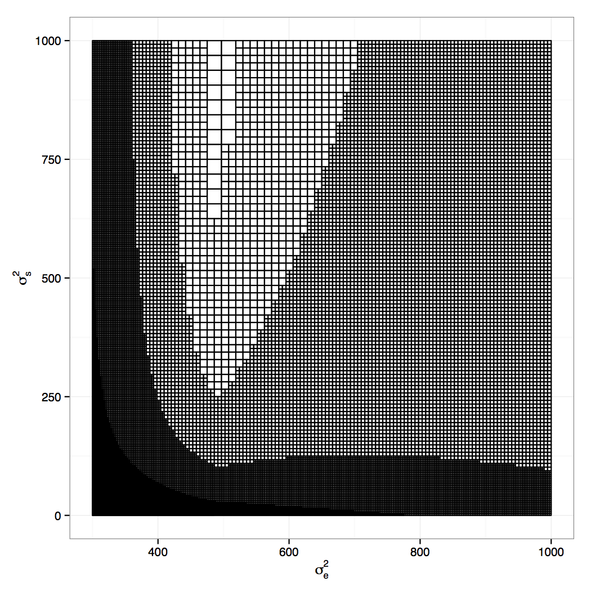
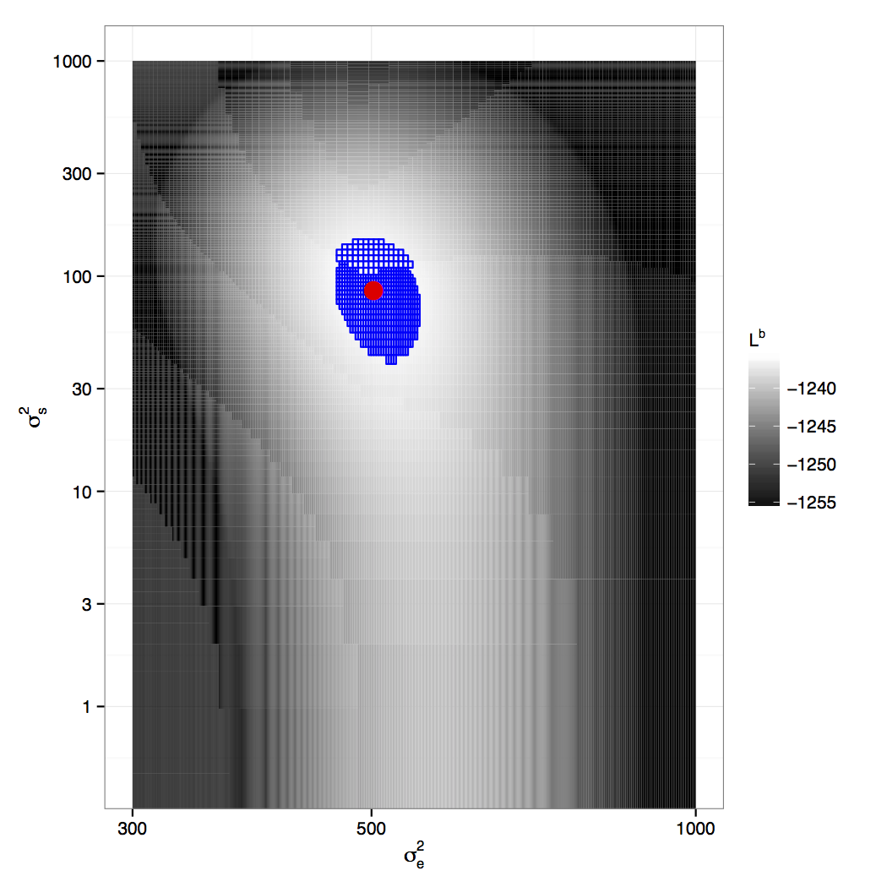

```{r global-opts, echo = FALSE, message = FALSE}
library(knitr)
opts_chunk$set(echo = FALSE, cache = TRUE)
```


## Where we're going

A method to evaluate the likelihood or posterior for a linear mixed model in order to

1. **Profile** the shape of the function for sensible inference
2. **Estimate** parameters

while being sure that we're not missing the global optimum.

<div class="centered">

</div>

## Genesis

<div class="centered">

</div>

\

*Approximately Exact Calculations for Linear Mixed Models*, Lavine and Hodges, 2015.


## Linear Mixed Models

\[ 
y = X \beta + Z u + \epsilon
\]

- $y$: vector of $n$ observations
- $X$: known $n \times p$ matrix
- $\beta$: vector of $p$ unknown fixed effects coefs
- $Z$: $n \times q$ matrix
- $u$: vector of $q$ unknown random effects coefs
- $\epsilon$: vector of $n$ errors

\[
\epsilon \sim \textrm{N}(0, R); \quad u \sim \textrm{N}(0, G)
\]

## Traditional estimation {.build}

> 1. Integrate out the fixed effects, maximize the restricted likelihood ($RL$) to estimate $G$ and $R$.
> 2. Treat $G$, $R$ as known. Plug into ML estimate for $\beta$ and $u$.

\

Main burden of calculation: optimize the **restricted likelihood**.


## Existing Methods in `lmer, nlme` {.build}

<div class="centered">

</div>

> - Nelder-Mead: iterative simplex
> - BOBYQA: quadratic approximation
> - BFGS: quasi-Newton

> - **Pros**: works for any $f$, derivative-free, fast
> - **Cons**: may not converge, can miss global optima

# Groundwork

## The Re-expression {.build}

Two variance model:

$$
\epsilon \sim \textrm{N}(0, \sigma^2_e \Sigma_e); \quad u \sim \textrm{N}(0, \sigma^2_s \Sigma_s)
$$

\

A more tractable objective function:

$$
\log \pi (\sigma^2_e, \sigma^2_s) \propto \sum_j \left[ c_j \log (a_j \sigma^2_s + b_j \sigma^2_e ) +  \frac{d_j}{a_j \sigma^2_s + b_j \sigma^2_e} \right]
$$

\

$$
\{a_j, b_j, c_j, d_j\} > 0
$$

## Exploiting the linear structure

$$
c_j \log(\textrm{linear term}) + \frac{d_j}{\textrm{linear term}}
$$

```{r log-fxn, fig.height=3.2, fig.width=8}
x <- 1:6000
minv <- c(30, 300, 3000)
maxes <- rep(NA, 3)
par(mfrow = c(1, 3))
for(i in 1:3) {
  fx <- -0.5 * (log(x) + minv[i]/x)
  plot(x, fx, type = "n", ylab = "f", xlab = "linear term",
       main = bquote(d[j] ~ "=" ~ .(minv[i])))
  lines(x, fx, col = "goldenrod", lwd = 2)
  abline(v = which.max(fx), col = "cadetblue", lwd = 2)
  maxes[i] <- max(fx)
}
```


## Exploiting the linear structure {.smaller .build}

$$
f(\sigma^2_e, \sigma^2_s) \propto \sum_j \left[ c_j \log (a_j \sigma^2_s + b_j \sigma^2_e ) + \frac{d_j}{(a_j \sigma^2_s + b_j \sigma^2_e)} \right]
$$

<hr>

\

$$
\frac{\partial f(\sigma^2_e, \sigma^2_s)}{\partial \sigma^2_e} \propto \sum_j \frac{a_j (a_j c_j \sigma^2_s + b_j c_j \sigma^2_e - d_j)}{(a_j \sigma^2_s + b_j \sigma^2_e)^2}
$$

\

\

$$
\begin{aligned}
0 &= a_j c_j \sigma^2_s + b_j c_j \sigma^2_e - d_j \\
\\
\sigma^2_s &= \frac{d_j}{a_j c_j} - \frac{b_j}{a_j}\sigma^2_e
\end{aligned}
$$


## Contribution of one term {.smaller .flexbox .vcenter}

```{r heatmap, fig.align='center', fig.height=4.5, fig.width=5.9}
npix <- 400
a_j <- 12.9
b_j <- 1
c_j <- 1
d_j <- 5
x <- seq(0, 57, length.out = npix)
y <- seq(0, 3, length.out = npix)
fterm <- function(x, y, a_j, b_j) {
  linearterm <- a_j * y + b_j * x
  ifelse(linearterm == 0, NA,
         -0.5 * (c_j * log(linearterm) + d_j/linearterm))
}
z <- outer(x, y, FUN = fterm, a_j = a_j, b_j = b_j)
xyzdf <- data.frame(x = rep(x, npix),
                    y = rep(y, each = npix),
                    z = c(z))

# plot surface in original coordinates
library(ggplot2); library(RColorBrewer)
mypal <- colorRampPalette(brewer.pal(6 , "YlOrRd"))
xyzdf$zbinned <- cut(xyzdf$z,breaks = c(-Inf, seq(-2.5, -1.3, length.out = 14)), right = FALSE)
p <- ggplot(xyzdf) + aes(x = x, y = y, fill = zbinned) +
  scale_fill_manual(values = rev(mypal(15)))+
  labs(x = expression(sigma[e]^2), y = expression(sigma[s]^2), fill = "f") +
  theme_bw()
q <- p + geom_tile(alpha = 0) +
  geom_abline(intercept = d_j / (a_j * c_j), slope = -b_j / a_j, col = "cadetblue", lwd = 1.5)
q
```

$a_j = 12.9; \quad b_j = 1; \quad c_j = 1; \quad d_j = 5$

$f$ is maxed along $\sigma^2_s = \frac{d_j}{a_j c_j} - \frac{b_j}{a_j}\sigma^2_e$


## Contribution of one term {.smaller .flexbox .vcenter}

```{r heatmap2, fig.align='center', fig.height=4.5, fig.width=5.9}
q + annotate("point", pch = "+", x = 1, y = .05, size = 13) + 
  annotate("point", pch = "-", x = 7, y = .3, size = 16)
```

&nbsp;

&nbsp;

## Contribution of one term {.smaller .flexbox .vcenter}

```{r heatmap3, fig.align='center', fig.height=4.5, fig.width=5.9}
w <- p + geom_tile() +
  geom_abline(intercept = d_j / (a_j * c_j), slope = -b_j / a_j, col = "cadetblue", lwd = 1.5)
w
```

&nbsp;

&nbsp;

## Box above line {.smaller .flexbox .vcenter}

```{r heatmap4, fig.align='center', fig.height=4.5, fig.width=5.9}
w + annotate("rect", xmin = 15, xmax = 25, ymin = .65, ymax = 1.2, alpha = .2)
```

&nbsp;

&nbsp;

## Box above line {.smaller .flexbox .vcenter}

```{r heatmap5, fig.align='center', fig.height=4.5, fig.width=5.9}
b1 <- w + annotate("rect", xmin = 15, xmax = 25, ymin = .65, ymax = 1.2, alpha = .2) +
  annotate("point", x = 15, y = .65) + 
  annotate("text", x = 17, y = .59, label = "A")
b1
```

&nbsp;

&nbsp;

## Box above line {.smaller .flexbox .vcenter}

```{r heatmap6, fig.align='center', fig.height=4.5, fig.width=5.9}
b2 <- b1 + annotate("point", x = 25, y = 1.2) + 
  annotate("text", x = 27, y = 1.14, label = "B")
b2
```

Bounds on $f$ in box $b_a: \left(f(B), f(A) \right)$

&nbsp;

## Box straddles line {.smaller .flexbox .vcenter}

```{r heatmap6b, fig.align='center', fig.height=4.5, fig.width=5.9}
b2b <- w + annotate("rect", xmin = 2, xmax = 12, ymin = .1, ymax = .65, alpha = .2)
b2b
```

&nbsp;

&nbsp;

## Box straddles line {.smaller .flexbox .vcenter}

```{r heatmap6c, fig.align='center', fig.height=4.5, fig.width=5.9}
b2b + annotate("point", x = 2, y = .1) + 
  annotate("text", x = 0, y = .12, label = "A") +
  annotate("point", x = 12, y = .65) + 
  annotate("text", x = 14, y = .59, label = "B") +
  annotate("point", x = 2, y = .23) + 
  annotate("text", x = 4, y = .3, label = "C")
```

Bounds on $f$ in box $b_s: \left(min\left(f(A), f(B)\right), f(C) \right)$

&nbsp;

## Branch for more precision {.smaller .flexbox .vcenter}

```{r heatmap7pre, fig.align='center', fig.height=4.5, fig.width=5.9}
w + annotate("rect", xmin = 15, xmax = 25, ymin = .65, ymax = 1.2, alpha = .2)
```

&nbsp;

&nbsp;

## Branch for more precision {.smaller .flexbox .vcenter}

```{r heatmap7, fig.align='center', fig.height=4.5, fig.width=5.9}
b3 <- w + annotate("rect", xmin = 15, xmax = 19.5, ymin = .65, ymax = .925 - 0.0275, alpha = .2) +
  annotate("rect", xmin = 20.5, xmax = 25, ymin = .65, ymax = .925 - 0.0275, alpha = .2) +
  annotate("rect", xmin = 15, xmax = 19.5, ymin = .925 + 0.0275, ymax = 1.2, alpha = .2) +
  annotate("rect", xmin = 20.5, xmax = 25, ymin = .925 + 0.0275, ymax = 1.2, alpha = .2)
b3
```

&nbsp;

&nbsp;

## Branch for more precision {.smaller .flexbox .vcenter}

```{r heatmap8, fig.align='center', fig.height=4.5, fig.width=5.9}
b4 <- b3 + annotate("point", x = 15, y = .65, col = "cadetblue") +
  annotate("point", x = 20, y = .65, col = "cadetblue") +
  annotate("point", x = 15, y = .925, col = "cadetblue") +
  annotate("point", x = 20, y = .925, col = "cadetblue")
b4
```

&nbsp;

&nbsp;

## Branch for more precision {.smaller .flexbox .vcenter}

```{r heatmap9, fig.align='center', fig.height=4.5, fig.width=5.9}
b4 + annotate("point", x = 20, y = .925, col = "navajowhite") +
  annotate("point", x = 25, y = .925, col = "navajowhite") +
  annotate("point", x = 20, y = 1.2, col = "navajowhite") +
  annotate("point", x = 25, y = 1.2, col = "navajowhite")
```

&nbsp;

&nbsp;

## Observations from one term {.build}

> - Each term is maximized along a line in Q1.
> - Slope < 0 and intercept > 0.
> - Within $b$ the top-right and bottom-left form the bounds.
>     - above the line, $\left(f(TR), f(BL)\right)$
>     - below the line, $\left(f(BL), f(TR)\right)$
>     - straddle the line, $\left(min(f(TR), f(BL)), f(line)\right)$
> - For narrower bounds, subdivide $b$ (branch).

## Contribution of two terms {.smaller}

```{r twoterms, fig.align='center', fig.height=4.5, fig.width=5.9}
w2 <- p + geom_tile(alpha = 0) +
  annotate("rect", xmin = 15, xmax = 25, ymin = .65, ymax = 1.2, alpha = .2) +
  annotate("point", x = 25, y = 1.2) + 
  annotate("text", x = 27, y = 1.14, label = "B") +
  annotate("point", x = 15, y = .65) + 
  annotate("text", x = 17, y = .59, label = "A")
w2 + annotate("text", x = 11, y = .03, label = "j = 1", size = 4) +
  geom_abline(intercept = d_j / (a_j * c_j), slope = -b_j / a_j, col = "cadetblue", lwd = 1.5)
```

$$
j = 1; \quad \left(f_1(B), f_1(A) \right)
$$

&nbsp;

## Contribution of two terms {.smaller .flexbox .vcenter}

```{r twoterms2, fig.align='center', fig.height=4.5, fig.width=5.9}
w2 + annotate("text", x = 11, y = .03, label = "j = 1", size = 4, col = "grey") +
  geom_abline(intercept = d_j / (a_j * c_j), slope = -b_j / a_j, col = "lightgrey", lwd = 1.5) +
  annotate("text", x = 53, y = .6, size = 4, label = "j = 2") +
  geom_abline(intercept = 1.8, slope = -.018, col = "cadetblue", lwd = 1.5)
```

$$
j = 1; \quad \left(f_1(B), f_1(A) \right) \\
j = 2; \quad \left(f_2(A), f_2(B) \right)
$$

## Contribution of two terms {.smaller .flexbox .vcenter}

```{r twoterms3, fig.align='center', fig.height=4.5, fig.width=5.9}
w2 + annotate("text", x = 11, y = .03, label = "j = 1", size = 4, col = "grey") +
  geom_abline(intercept = d_j / (a_j * c_j), slope = -b_j / a_j, col = "lightgrey", lwd = 1.5) +
  annotate("text", x = 53, y = .6, size = 4, label = "j = 2") +
  geom_abline(intercept = 1.8, slope = -.018, col = "cadetblue", lwd = 1.5)
```


$$
 \left.\begin{aligned}
        j &= 1; \quad \left(f_1(B), f_1(A) \right)\\
        j &= 2; \quad \left(f_2(A), f_2(B) \right)
       \end{aligned}
 \right\}
 \qquad \underbrace{f_1(B) + f_2(A)}_{L^b}, \underbrace{f_1(A) + f_2(B)}_{U^b}
$$

## Observations from two terms {.build}

Within box $b$, the bounds on $f$ can be formed by

$$
L^b \equiv \sum_j L^b_j \\
U^b \equiv \sum_j U^b_j
$$

where each term in the sum is $f_j(p)$ evaluated at the appropriate point $p$.

Because $f$ is continuous, $U^b - L^b \rightarrow 0$ as $b$ shrinks in both directions.

# An algorithm

## {.build}

To evaluate $f$ arbitrarily well everywhere within active box $B$,

> 1. Specify $\epsilon$.
> 2. With $y, X, Z$ compute $\{a_j, b_j, c_j, d_j\}$ for all $j$.
> 3. For every active box $b$
>  - evaluate $f_j(p)$ for all $j$ to get $L^b, U^b$
>  - if $U^b - L^b < \epsilon$, make $b$ inactive
>  - else subdivide $b$ into 4 active boxes and repeat (3).

\

For optimization only:

- make $b$ inactive if $U^b << L^{global}$


# Example

## Health care costs {.build}

**Question**: what will be the estimated cost of moving people to HMO plans?

Data on cost of $i = 1, \ldots, 341$ plans in $j = 1, \ldots, 45$ states

$$
\begin{aligned}
y_{ij} &= \alpha_j + \epsilon_{ij} \\
\alpha_j &= \beta_0 + \beta_1 x_{1j} + \beta_2 x_{2j} + \delta_j
\end{aligned}
$$

- $y$: vector of plan costs
- $X$: 341 $\times$ 3 matrix (intercept, avg. cost, New England)
- $Z$: 341 $\times$ 45 matrix

$$
\epsilon \sim \textrm{N}(0, \sigma^2_e \Sigma_e); \quad \delta \sim \textrm{N}(0, \sigma^2_s \Sigma_s)
$$

## Terms in the sum

<div class="centered">

</div>

## 10 iterations, 640 boxes

<div class="centered">

</div>

## Restricted LL

<div class="centered">

</div>

## 12 iterations, 37,516 boxes

<div class="centered">

</div>


## Restricted LL

<div class="centered">

</div>


# Remarks

## Where we went

A method to evaluate the likelihood or posterior for a linear mixed model in order to

1. **Profile** the shape of the function for sensible inference
2. **Estimate** parameters

while being sure that **we're not missing global optima**.

<div class="centered">

</div>

## Next steps {.build}

> - Efficiency/Speed
>     - Utilize structure of $f$
>     - Pre-allocate memory for (`library(data.table)`)
>     - Sequential runs / alternation.
> - Generalization
>     - Three variance? Four Variance?

## Resources {.smaller}

- R package and this presentation at:

`www.github.com/andrewpbray/lmmoptim`

- Lavine & Hodges (2015), *Approximately Exact Calculations for Linear Mixed Models*.
- Hodges (2013), *Richly Parameterized Linear Models*, CRC Press.
- Reich & Hodges (2008), *Identification of the variance components in the general two-variance linear model*, Journal of Statistical Planning and Inference.

\

Thanks for having us!
