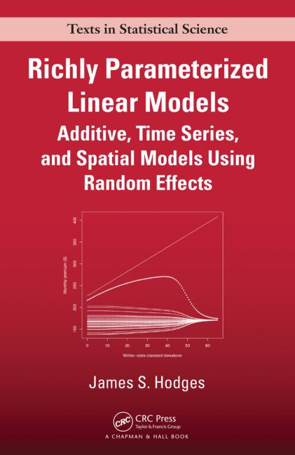

```{r global-opts, echo = FALSE, message = FALSE}
library(knitr)
opts_chunk$set(echo = FALSE, cache = TRUE)
```


## Where we're going

A method to evaluate the likelihood or posterior for a linear mixed model in order to

1. **Profile** the shape of the function for sensible inference
2. **Estimate** parameters

while being sure that we're not missing the global optimum.


## Genesis

<div class="centered">

</div>

\

*Approximately Exact Calculations for Linear Mixed Models*, Lavine and Hodges, 2015.


## Linear Mixed Models

\[ 
y = X \beta + Z u + \epsilon
\]

- $y$: vector of $n$ observations
- $X$: known $n \times p$ matrix
- $\beta$: vector of $p$ unknown fixed effects coefs
- $Z$: $n \times q$ matrix
- $u$: vector of $q$ unknown random effects coefs
- $\epsilon$: vector of $n$ errors

\[
\epsilon \sim \textrm{N}(0, \sigma^2_e \Sigma_e); \quad u \sim \textrm{N}(0, \sigma^2_s \Sigma_s)
\]

## Traditional estimation


## Existing Methods in `lmer, nlme`

1. BOBYQA: quadratic approximation
2. Nelder-Mead: iterative simplex
3. BFGS: quasi-Newton

<div class="centered">

</div>

**Pros**: works for any $f$, derivative-free, fast

**Cons**: may not converge, can miss global optima


## The Re-expression

## The Objective Functions

**Log restricted likelihood**

\[
\log \textrm{RL} (\sigma^2_e, \sigma^2_s) = B - \frac{n_e}{2}\log(\sigma^2_e) - \frac{y'\Gamma_c \Gamma_c' y}{2 \sigma^2_e} - \frac{1}{2} \sum_j \left[ \log(a_j \sigma^2_s + \sigma^2_e) + \frac{\hat{v}^2_j}{a_j \sigma^2_s + \sigma^2_e} \right]
\]

**Log posterior**

\[
\log \pi (\sigma^2_e, \sigma^2_s) = B - \frac{1}{2}\sum_j \left[ c_j \log (a_j \sigma^2_s + b_j \sigma^2_e ) \frac{d_j}{a_j \sigma^2_s + b_j \sigma^2_e} \right]
\]


# Groundwork

## Objectives

Develop a method to evaluate $f(\sigma^2_e, \sigma^2_s)$ in order to

1. **Profile** the shape of the function for sensible inference
2. **Estimate** parameters


## Exploiting the Linear structure {.smaller .build}

$$
f(\sigma^2_e, \sigma^2_s) \propto \sum_j \left[ c_j \log (a_j \sigma^2_s + b_j \sigma^2_e ) + \frac{d_j}{(a_j \sigma^2_s + b_j \sigma^2_e)} \right]
$$

<hr>

\

$$
\frac{\partial f(\sigma^2_e, \sigma^2_s)}{\partial \sigma^2_e} \propto \sum_j \frac{a_j (a_j c_j \sigma^2_s + b_j c_j \sigma^2_e - d_j)}{(a_j \sigma^2_s + b_j \sigma^2_e)^2}
$$

\

\

$$
\begin{aligned}
0 &= a_j c_j \sigma^2_s + b_j c_j \sigma^2_e - d_j \\
\sigma^2_s &= \frac{d_j}{a_j c_j} - \frac{b_j}{a_j}\sigma^2_e
\end{aligned}
$$


## Contribution of one term {.smaller .flexbox .vcenter}

```{r heatmap, fig.align='center', fig.height=4.5, fig.width=5.9}
npix <- 400
a_j <- 12.9
b_j <- 1
c_j <- 1
d_j <- 5
x <- seq(0, 57, length.out = npix)
y <- seq(0, 3, length.out = npix)
fterm <- function(x, y, a_j, b_j) {
  linearterm <- a_j * y + b_j * x
  ifelse(linearterm == 0, NA,
         -0.5 * (c_j * log(linearterm) + d_j/linearterm))
}
z <- outer(x, y, FUN = fterm, a_j = a_j, b_j = b_j)
xyzdf <- data.frame(x = rep(x, npix),
                    y = rep(y, each = npix),
                    z = c(z))

# plot surface in original coordinates
library(ggplot2); library(RColorBrewer)
mypal <- colorRampPalette(brewer.pal(6 , "YlOrRd"))
xyzdf$zbinned <- cut(xyzdf$z,breaks = c(-Inf, seq(-2.5, -1.3, length.out = 14)), right = FALSE)
p <- ggplot(xyzdf) + aes(x = x, y = y, fill = zbinned) +
  scale_fill_manual(values = rev(mypal(15)))+
  labs(x = expression(sigma[e]^2), y = expression(sigma[s]^2), fill = "f") +
  theme_bw()
q <- p + geom_tile(alpha = 0) +
  geom_abline(intercept = d_j / (a_j * c_j), slope = -b_j / a_j, col = "cadetblue", lwd = 1.5)
q
```

$a_j = 12.9; \quad b_j = 1; \quad c_j = 1; \quad d_j = 5$

$f$ is maxed along $\sigma^2_s = \frac{d_j}{a_j c_j} - \frac{b_j}{a_j}\sigma^2_e$


## Contribution of one term {.smaller .flexbox .vcenter}

```{r heatmap2, fig.align='center', fig.height=4.5, fig.width=5.9}
q + annotate("point", pch = "+", x = 1, y = .05, size = 13) + 
  annotate("point", pch = "-", x = 7, y = .3, size = 16)
```

&nbsp;

&nbsp;

## Contribution of one term {.smaller .flexbox .vcenter}

```{r heatmap3, fig.align='center', fig.height=4.5, fig.width=5.9}
w <- p + geom_tile() +
  geom_abline(intercept = d_j / (a_j * c_j), slope = -b_j / a_j, col = "cadetblue", lwd = 1.5)
w
```

&nbsp;

&nbsp;

## Contribution of one term {.smaller .flexbox .vcenter}

```{r heatmap4, fig.align='center', fig.height=4.5, fig.width=5.9}
w + annotate("rect", xmin = 15, xmax = 25, ymin = .65, ymax = 1.2, alpha = .2)
```

&nbsp;

&nbsp;

## Contribution of one term {.smaller .flexbox .vcenter}

```{r heatmap5, fig.align='center', fig.height=4.5, fig.width=5.9}
b1 <- w + annotate("rect", xmin = 15, xmax = 25, ymin = .65, ymax = 1.2, alpha = .2) +
  annotate("point", x = 15, y = .65) + 
  annotate("text", x = 17, y = .59, label = "A")
b1
```

&nbsp;

&nbsp;

## Contribution of one term {.smaller .flexbox .vcenter}

```{r heatmap6, fig.align='center', fig.height=4.5, fig.width=5.9}
b2 <- b1 + annotate("point", x = 25, y = 1.2) + 
  annotate("text", x = 27, y = 1.14, label = "B")
b2
```

Bounds on $f$ in box $b: \left(f(B), f(A) \right)$

&nbsp;

## Branch for more precision {.smaller .flexbox .vcenter}

```{r heatmap7, fig.align='center', fig.height=4.5, fig.width=5.9}
b3 <- w + annotate("rect", xmin = 15, xmax = 19.5, ymin = .65, ymax = .925 - 0.0275, alpha = .2) +
  annotate("rect", xmin = 20.5, xmax = 25, ymin = .65, ymax = .925 - 0.0275, alpha = .2) +
  annotate("rect", xmin = 15, xmax = 19.5, ymin = .925 + 0.0275, ymax = 1.2, alpha = .2) +
  annotate("rect", xmin = 20.5, xmax = 25, ymin = .925 + 0.0275, ymax = 1.2, alpha = .2)
b3
```

&nbsp;

&nbsp;

## Branch for more precision {.smaller .flexbox .vcenter}

```{r heatmap8, fig.align='center', fig.height=4.5, fig.width=5.9}
b4 <- b3 + annotate("point", x = 15, y = .65, col = "cadetblue") +
  annotate("point", x = 20, y = .65, col = "cadetblue") +
  annotate("point", x = 15, y = .925, col = "cadetblue") +
  annotate("point", x = 20, y = .925, col = "cadetblue")
b4
```

&nbsp;

&nbsp;

## Branch for more precision {.smaller .flexbox .vcenter}

```{r heatmap9, fig.align='center', fig.height=4.5, fig.width=5.9}
b4 + annotate("point", x = 20, y = .925, col = "navajowhite") +
  annotate("point", x = 25, y = .925, col = "navajowhite") +
  annotate("point", x = 20, y = 1.2, col = "navajowhite") +
  annotate("point", x = 25, y = 1.2, col = "navajowhite")
```

&nbsp;

&nbsp;

## Contribution of one term {.build}

> - Each term is maximized along a line in Q1.
> - Slope < 0 and intercept > 0.
> - Within $b$ the top-right and bottom-left form the bounds.
>     - above the line, $\left(f(TR), f(BL)\right)$
>     - below the line, $\left(f(BL), f(TR)\right)$
>     - straddle the line, $\left(min(f(TR), f(BL)), f(line)\right)$
> - For narrower bounds, subdivide $b$ (branch).

## Contribution of two terms {.smaller .flexbox .vcenter}

```{r twoterms, fig.align='center', fig.height=4.5, fig.width=5.9}
w2 <- p + geom_tile(alpha = 0) +
  annotate("rect", xmin = 15, xmax = 25, ymin = .65, ymax = 1.2, alpha = .2) +
  annotate("point", x = 25, y = 1.2) + 
  annotate("text", x = 27, y = 1.14, label = "B") +
  annotate("point", x = 15, y = .65) + 
  annotate("text", x = 17, y = .59, label = "A")
w2 + annotate("text", x = 11, y = .03, label = "j = 1", size = 4) +
  geom_abline(intercept = d_j / (a_j * c_j), slope = -b_j / a_j, col = "cadetblue", lwd = 1.5)
```

$j = 1; \quad \left( f(B), f(A) \right)$

&nbsp;

## Contribution of two terms {.smaller .flexbox .vcenter}

```{r twoterms2, fig.align='center', fig.height=4.5, fig.width=5.9}
w2 + annotate("text", x = 11, y = .03, label = "j = 1", size = 4, col = "grey") +
  geom_abline(intercept = d_j / (a_j * c_j), slope = -b_j / a_j, col = "lightgrey", lwd = 1.5) +
  annotate("text", x = 53, y = .6, size = 4, label = "j = 2") +
  geom_abline(intercept = 1.8, slope = -.018, col = "cadetblue", lwd = 1.5)
```

$j = 1; \quad \left( f_1(B), f_1(A) \right)$

$j = 2; \quad \left( f_2(A), f_2(B) \right)$
  
# Example: Heath care costs


## Comparison to lmer
- reorder heatmap levels in legend
- is M needlessley complicated?
- why does v get a hat?

